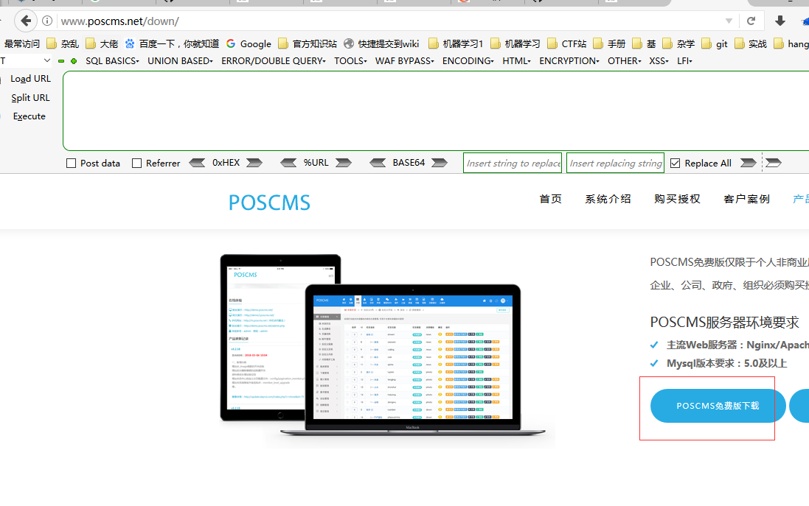
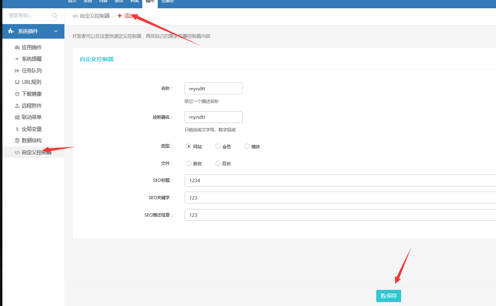
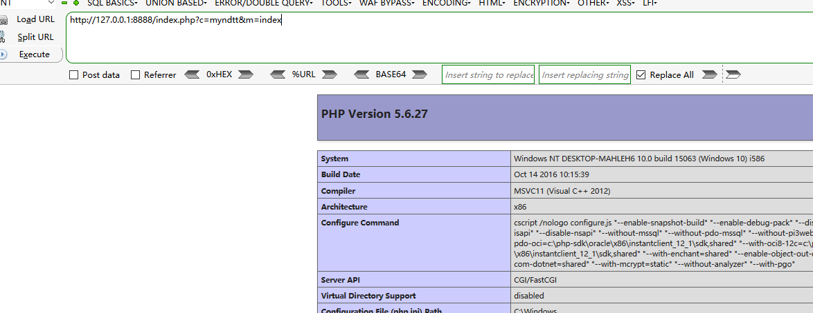

# edition

poscms 3.2.18

# condition

you should be a Administrator，

you can get the sourcecode from `http://www.poscms.net/down/`



# Code and Cause the cause

 the file of `diy\dayrui\controllers\admin\Syscontroller.php`  in the function of `add`:

```php
public function add() {  
5.	  
6.	    if (IS_POST || $_GET['post']) {  
7.	           $app = $this->input->post('app');  
8.	        $data = $this->input->post('data');  
9.	        if (!$data['name']) {  
10.	               exit(dr_json(0, fc_lang('【%s】不能为空', fc_lang('名称')), 'name'));  
11.	           } elseif (!$data['cname'] || !preg_match('/^[a-z]+[a-z0-9_\-]+$/i', $data['cname'])) {  
12.	               exit(dr_json(0, fc_lang('【%s】格式不正确', fc_lang('控制器名')), 'cname'));  
13.	           }  
14.	           $file = '';  
15.	           $name = ucfirst($data['cname']);
16. if ($app == 0) {  
17.	               if (strlen($data['type'][0]) == 0) {  
18.	                   exit(dr_json(0, fc_lang('【%s】未选择', fc_lang('文件'))));  
19.	               }  
20.	               $data['app'] = '';  
21.	               $data['type'] = $data['type'][0];  
22.	               if ($data['type'] == 0) {  
23.	                   $file = 'dayrui/controllers/'.$name.'.php';  
24.	               } elseif ($data['type'] == 2) {  
25.	                   $file = 'dayrui/controllers/admin/'.$name.'.php';  
26.	               }  
27.	           } elseif ($app == 1) {  
28.	               if (strlen($data['type'][1]) == 0) {  
29.	                   exit(dr_json(0, fc_lang('【%s】未选择', fc_lang('文件'))));  
30.	               }  
31.	               $data['app'] = 'member';  
32.	               $data['type'] = $data['type'][1];  
33.	               if ($data['type'] == 1) {  
34.	                   $file = 'module/member/controllers/'.$name.'.php';  
35.	               } elseif ($data['type'] == 2) {  
36.	                   $file = 'module/member/controllers/admin/'.$name.'.php';  
37.	               }  
38.	           } elseif ($app == 2) {  
39.	               $dir = $this->input->post('dir');  
40.	               if (!$dir) {  
41.	                   exit(dr_json(0, fc_lang('【%s】未选择', fc_lang('模块'))));  
42.	               }  
43.	               if (strlen($data['type'][2]) == 0) {  
44.	                   exit(dr_json(0, fc_lang('【%s】未选择', fc_lang('文件'))));  
45.	               }  
46.	               $data['app'] = $dir;  
47.	               $data['type'] = $data['type'][2];  
48.	               if ($data['type'] == 0) {  
49.	                   $file = 'module/'.$dir.'/controllers/'.$name.'.php';  
50.	               } elseif ($data['type'] == 2) {  
51.	                   $file = 'module/'.$dir.'/controllers/admin/'.$name.'.php';  
52.	               } elseif ($data['type'] == 1) {  
53.	                   $file = 'module/'.$dir.'/controllers/member/'.$name.'.php';  
54.	               }  
55.	           }  
56.	           if (is_file(FCPATH.$file)) {  
57.	               exit(dr_json(0, fc_lang('文件【%s】已经存在', $file)));  
58.	           }  
59.	           $data['url'] = '';  
60.	           $data['file'] = $file;  
61.	           $data['inputtime'] = SYS_TIME;  
62.	        $this->db->insert('controller', $data);  
63.	           $id = $this->db->insert_id();  
64.	           // 创建文件  
65.	           $code = file_get_contents(WEBPATH.'cache/install/sysc.php');  
66.	           $code = str_replace(  
67.	               array('{name}', '{cname}', '{icname}', '{id}'),  
68.	               array($data['name'], $data['cname'], $name, $id),  
69.	               $code  
70.	           );  
71.	           $a = file_put_contents(FCPATH.$file, $code);  
72.	           if (!$a) {  
73.	               $this->db->where('id', $id)->delete('controller');  
74.	               exit(dr_json(0, fc_lang('文件【%s】创建失败，请检查权限', $file)));  
75.	           }  
76.	           $this->system_log('添加除自定义控制器【#'.$id.'】'); // 记录日志  
77.	        exit(dr_json(1, fc_lang('控制器创建成功，马上进入详情界面'), $id));  
78.	    }  
79.	  
80.	       $dir = array();  
81.	       $local = @array_diff(dr_dir_map(FCPATH.'module/', 1), array('member')); // 搜索本地模块  
82.	       if ($local) {  
83.	           foreach ($local as $m) {  
84.	               if (is_file(FCPATH.'module/'.$m.'/config/module.php')) {  
85.	                   $dir[] = $m;  
86.	               }  
87.	           }  
88.	       }  
89.	  
90.	       $this->template->assign(array(  
91.	           'dir' => $dir,  
92.	       ));  
93.	    $this->template->display('syscontroller_add.html');  
94.	   }  

```

the function filter the value of` $data['cname']` but not filter the `$data['name']` the in the line 95-101:

```php
95.$code = file_get_contents(WEBPATH.'cache/install/sysc.php');  //
96.	           $code = str_replace(  
97.	               array('{name}', '{cname}', '{icname}', '{id}'),  
98.	               array($data['name'], $data['cname'], $name, $id),  //replace
    $code  
100.	           );  
101.	           $a = file_put_contents(FCPATH.$file, $code);  //写入文件

```

the variable of `$code` get the value of `$data['name']`,finally the value of `$code`  be  writed in the file of `FCPATH.$file`

# poc

一.




Capture the package and modify the value of `data[name]` to `myndtt*/phpinfo();/*` like this :


note: now here the value of `data[cname]` is also 'myntt',it  Influence the name of file.

then the file of `Myndtt.php` ({data[cname]}.php)will in the directory of `diy\dayrui\controllers\`  it like this:


then request the url of `http://yoursite/index.php?c=myndtt&m=index` it can be:

